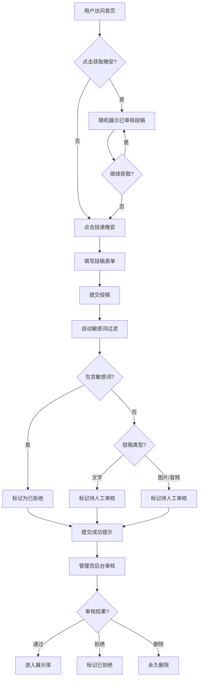

## 1. 产品概述

「海洋二所晚安计划」是一个温暖治愈的匿名投稿与随机展示平台，面向海洋二所全体成员，让每个人都能匿名分享一句晚安祝福、一段心情随笔、一张日常随拍或一段助眠音频，也让每个人都能随机获得来自他人的温暖晚安。
- 核心目标：打造一个轻量、匿名、治愈的晚安分享社区，让尽可能多的人都能得到一句"晚安"
- 目标用户：海洋二所全体成员，手机端为主要使用场景

## 2. 核心功能

### 2.1 用户角色

| 角色 | 注册方式 | 核心权限 |
|------|----------|----------|
| 匿名用户 | 无需注册 | 浏览晚安、匿名投稿 |
| 管理员 | 隐藏路径登录 | 审核投稿、管理敏感词、查看统计 |

### 2.2 功能模块

1. **首页（随机晚安展示页）**：「获取一句晚安」按钮、随机展示已审核投稿、跳转投稿入口
2. **投稿页**：匿名投稿表单，支持文字/图片/音频多选投稿
3. **投稿成功页**：提交成功提示、返回首页/再次投稿
4. **管理员登录页**：隐藏路径 `/admin-login`，账号密码登录
5. **管理员后台**：投稿管理、审核操作、敏感词管理、数据统计

### 2.3 页面详情

| 页面名称 | 模块名称 | 功能描述 |
|----------|----------|----------|
| 首页 | 晚安展示区 | 居中大按钮「获取一句晚安」，点击随机展示一条已审核通过的投稿 |
| 首页 | 投稿入口 | 底部「投递你的晚安」按钮，跳转投稿页 |
| 投稿页 | 标题区 | 显示「海洋二所"晚安计划"」标题及平台域名 |
| 投稿页 | 投稿说明 | 展示投稿类型说明文字（文字类/音频类/视觉类） |
| 投稿页 | 投稿形式选择 | 必填多选：文字/图片/音频，默认勾选文字 |
| 投稿页 | 文字输入区 | 勾选文字时显示，必填多行文本框 |
| 投稿页 | 图片上传区 | 勾选图片时显示，支持jpg/png/webp，单张≤20MB |
| 投稿页 | 音频上传区 | 勾选音频时显示，支持mp3/wav，单条≤10MB |
| 投稿页 | 昵称栏 | 选填单行文本框 |
| 投稿页 | 提交按钮 | 醒目提交按钮，加载状态，成功后弹出温馨提示 |
| 投稿成功页 | 成功提示 | 显示「你的晚安已成功投递，感谢分享温暖✨」 |
| 投稿成功页 | 操作按钮 | 「返回首页」和「再次投稿」两个按钮 |
| 管理员登录页 | 登录表单 | 账号密码输入，防止他人访问 |
| 管理员后台 | 投稿列表 | 按时间倒序展示所有投稿，显示ID/类型/时间/状态/预览 |
| 管理员后台 | 筛选搜索 | 按类型/状态筛选，按昵称/内容搜索 |
| 管理员后台 | 审核操作 | 通过/拒绝/永久删除，支持批量操作 |
| 管理员后台 | 敏感词管理 | 添加/删除/修改敏感词 |
| 管理员后台 | 数据统计 | 总投稿数/已通过数/已拒绝数/各类型占比 |

## 3. 核心流程

### 3.1 投稿流程
用户访问投稿页 → 阅读投稿说明 → 选择投稿形式（文字/图片/音频）→ 填写对应内容 → 可选填写昵称 → 点击提交 → 系统自动敏感词过滤 → 文字类：自动初审通过/拒绝；图片/音频：标记待人工审核 → 所有投稿进入待审核列表 → 提交成功提示

### 3.2 获取晚安流程
用户访问首页 → 点击「获取一句晚安」→ 从已审核通过库中随机抽取一条 → 展示内容（文字/图片/音频）→ 可继续点击获取新内容

### 3.3 管理员审核流程
管理员访问隐藏登录页 → 输入账号密码 → 进入后台 → 查看待审核列表 → 执行通过/拒绝/删除操作 → 只有「已通过」内容进入展示库

## 4. 用户界面设计

### 4.1 设计风格

- **主色调**：浅蓝（#A8D8EA）、米白（#FFF8F0）、暖黄（#FFD6A5）
- **辅助色**：淡紫（#E8D5F5）、柔粉（#FFB5C2）
- **按钮风格**：圆角胶囊按钮，柔和阴影，hover 时轻微上浮
- **字体**：标题使用「ZCOOL XiaoWei」（站酷小薇体），正文使用「Noto Sans SC」
- **布局风格**：移动端优先，卡片式布局，大量留白
- **图标/Emoji 风格**：使用 lucide-react 图标，搭配 ✨🌙💫 等治愈系 emoji
- **整体氛围**：星空夜景主题，深蓝渐变背景配暖色点缀，营造夜晚安宁感

### 4.2 页面设计概览

| 页面名称 | 模块名称 | UI 元素 |
|----------|----------|----------|
| 首页 | 晚安展示区 | 深蓝渐变背景，居中大号胶囊按钮「获取一句晚安」配月亮图标，点击后卡片式展示内容，淡入动画 |
| 首页 | 投稿入口 | 底部固定「投递你的晚安」按钮，暖黄色调，配信封图标 |
| 投稿页 | 标题区 | 居中标题配月亮装饰，下方小字显示域名 |
| 投稿页 | 投稿说明 | 浅色卡片包裹说明文字，左侧竖线装饰 |
| 投稿页 | 形式选择 | 自定义多选复选框，选中时暖色填充+勾选动画 |
| 投稿页 | 输入区域 | 圆角输入框，柔和边框，聚焦时暖色高亮 |
| 投稿页 | 文件上传 | 虚线边框拖拽区域，上传图标+提示文字 |
| 投稿页 | 提交按钮 | 全宽暖黄色胶囊按钮，加载时旋转动画 |
| 投稿成功页 | 成功提示 | 居中大号 ✨ 图标，温馨提示文字，两个操作按钮 |
| 管理员登录页 | 登录表单 | 居中卡片式表单，简洁输入框 |
| 管理员后台 | 投稿列表 | 表格布局，状态标签彩色区分，操作按钮组 |
| 管理员后台 | 筛选搜索 | 顶部筛选栏+搜索框 |
| 管理员后台 | 敏感词管理 | 标签式展示，添加/删除操作 |
| 管理员后台 | 数据统计 | 顶部统计卡片组，彩色数字 |

### 4.3 响应式设计

- **移动端优先**：所有页面优先适配手机端（375px-428px）
- **平板适配**：768px-1024px 自适应布局
- **桌面适配**：1024px+ 居中限宽布局
- **触控优化**：按钮最小 44px 触控区域，输入框适当增大
- **文件上传**：移动端调用系统文件选择器

### 4.4 动效设计

- 页面切换：淡入淡出过渡
- 按钮点击：轻微缩放+波纹效果
- 晚安卡片展示：从下方滑入+淡入
- 星空背景：CSS 粒子闪烁动画
- 提交成功：✨ 图标缩放弹跳动画
