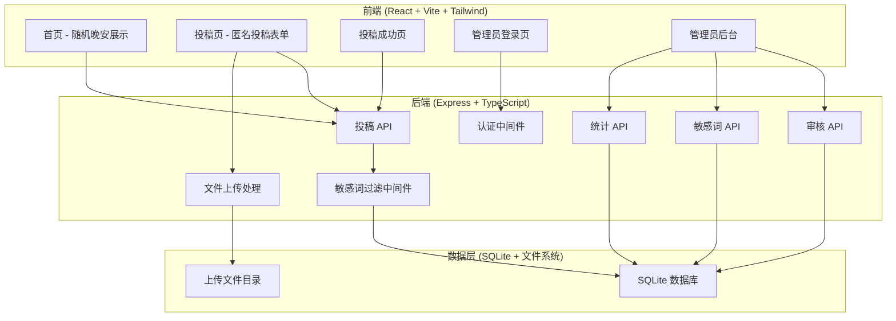
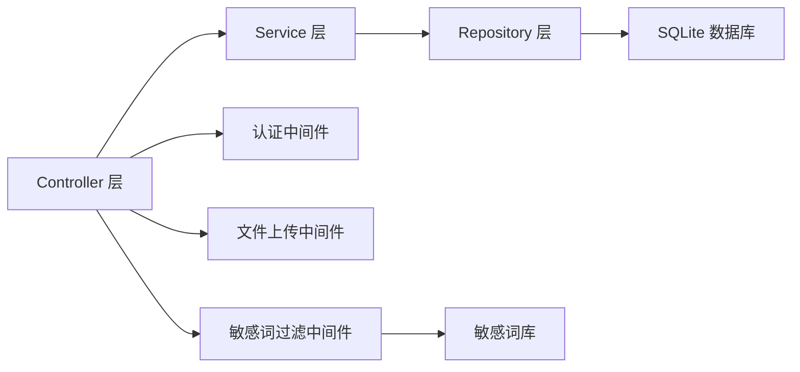
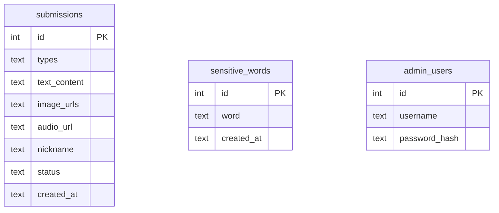

## 1. 架构设计



## 2. 技术说明

- **前端**：React@18 + Tailwind CSS@3 + Vite + Zustand（状态管理）
- **初始化工具**：vite-init（react-express-ts 模板）
- **后端**：Express@4 + TypeScript（ESM 格式）
- **数据库**：SQLite（better-sqlite3），轻量级无需额外配置
- **文件存储**：本地文件系统，上传目录 `uploads/`
- **认证**：JWT Token，管理员登录后签发
- **文件上传**：multer 中间件处理 multipart/form-data

## 3. 路由定义

| 路由 | 用途 |
|------|------|
| `/` | 首页 - 随机晚安展示 |
| `/submit` | 投稿页 - 匿名投稿表单 |
| `/submit/success` | 投稿成功页 |
| `/admin-login` | 管理员登录页（隐藏路径） |
| `/admin` | 管理员后台 - 投稿管理 |

## 4. API 定义

### 4.1 公开接口

```typescript
// 获取随机晚安
GET /api/submissions/random
Response: {
  id: number;
  type: "text" | "image" | "audio";
  content: string;       // 文字内容
  imageUrl?: string;     // 图片URL
  audioUrl?: string;     // 音频URL
  nickname: string | null;
  createdAt: string;
}

// 提交投稿
POST /api/submissions
Content-Type: multipart/form-data
Body: {
  types: ("text" | "image" | "audio")[];  // 投稿类型
  textContent?: string;                     // 文字内容
  images?: File[];                          // 图片文件
  audio?: File;                             // 音频文件
  nickname?: string;                        // 昵称
}
Response: {
  success: boolean;
  message: string;
  id: number;
}
```

### 4.2 管理员接口（需 JWT 认证）

```typescript
// 管理员登录
POST /api/admin/login
Body: { username: string; password: string }
Response: { token: string; }

// 获取投稿列表
GET /api/admin/submissions?type=text|image|audio&status=pending|approved|rejected&search=keyword&page=1&limit=20
Response: {
  data: Submission[];
  total: number;
  page: number;
  limit: number;
}

// 审核投稿
PUT /api/admin/submissions/:id/status
Body: { status: "approved" | "rejected" }
Response: { success: boolean; }

// 删除投稿
DELETE /api/admin/submissions/:id
Response: { success: boolean; }

// 批量审核
PUT /api/admin/submissions/batch
Body: { ids: number[]; status: "approved" | "rejected" }
Response: { success: boolean; count: number; }

// 批量删除
DELETE /api/admin/submissions/batch
Body: { ids: number[] }
Response: { success: boolean; count: number; }

// 获取敏感词列表
GET /api/admin/sensitive-words
Response: { words: SensitiveWord[] }

// 添加敏感词
POST /api/admin/sensitive-words
Body: { word: string }
Response: { success: boolean; id: number; }

// 删除敏感词
DELETE /api/admin/sensitive-words/:id
Response: { success: boolean; }

// 获取统计数据
GET /api/admin/stats
Response: {
  total: number;
  approved: number;
  rejected: number;
  pending: number;
  byType: { text: number; image: number; audio: number; };
}
```

### 4.3 类型定义

```typescript
interface Submission {
  id: number;
  types: string;           // JSON 数组字符串
  text_content: string | null;
  image_urls: string | null;  // JSON 数组字符串
  audio_url: string | null;
  nickname: string | null;
  status: "pending" | "approved" | "rejected";
  created_at: string;
}

interface SensitiveWord {
  id: number;
  word: string;
  created_at: string;
}
```

## 5. 服务端架构图



## 6. 数据模型

### 6.1 数据模型定义



### 6.2 数据定义语言

```sql
CREATE TABLE IF NOT EXISTS submissions (
  id INTEGER PRIMARY KEY AUTOINCREMENT,
  types TEXT NOT NULL,
  text_content TEXT,
  image_urls TEXT,
  audio_url TEXT,
  nickname TEXT,
  status TEXT NOT NULL DEFAULT 'pending' CHECK(status IN ('pending', 'approved', 'rejected')),
  created_at TEXT NOT NULL DEFAULT (datetime('now', 'localtime'))
);

CREATE INDEX IF NOT EXISTS idx_submissions_status ON submissions(status);
CREATE INDEX IF NOT EXISTS idx_submissions_created_at ON submissions(created_at DESC);

CREATE TABLE IF NOT EXISTS sensitive_words (
  id INTEGER PRIMARY KEY AUTOINCREMENT,
  word TEXT NOT NULL UNIQUE,
  created_at TEXT NOT NULL DEFAULT (datetime('now', 'localtime'))
);

CREATE TABLE IF NOT EXISTS admin_users (
  id INTEGER PRIMARY KEY AUTOINCREMENT,
  username TEXT NOT NULL UNIQUE,
  password_hash TEXT NOT NULL
);

-- 初始管理员账号（密码将在首次启动时通过环境变量设置）
-- 默认: admin / goodnight2026

-- 初始敏感词库
INSERT INTO sensitive_words (word) VALUES
  ('自杀'), ('死亡'), ('杀'), ('毒品'), ('赌博'),
  ('色情'), ('暴力'), ('反动'), ('政治'), ('上访'),
  ('抗议'), ('示威'), ('罢工'), ('邪教'), ('传销');
```

## 7. 文件存储策略

- **上传目录**：`uploads/images/` 和 `uploads/audio/`
- **文件命名**：`{timestamp}-{random}.{ext}`，避免文件名冲突
- **图片处理**：使用 sharp 库自动压缩，最大宽度 1200px，质量 80%
- **音频处理**：限制文件大小，前端预校验格式
- **静态文件服务**：Express 静态中间件提供 `/uploads` 路径访问

## 8. 安全策略

- **管理员认证**：JWT Token，24小时过期，存储在 localStorage
- **密码存储**：bcrypt 哈希加密
- **文件上传安全**：服务端校验文件类型和大小，限制上传格式
- **输入过滤**：XSS 防护，HTML 转义用户输入
- **速率限制**：投稿接口限制每 IP 每分钟 3 次
- **CORS 配置**：仅允许同源访问
